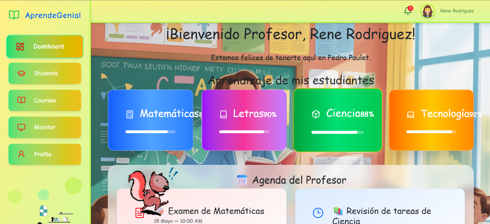

# TechClass FrontEnd

¡Bienvenido a **TechClass FrontEnd**! Este es un proyecto desarrollado en **React** con **TypeScript** y **Vite** para la gestión educativa. La aplicación permite a administradores, profesores y estudiantes interactuar con diferentes funcionalidades, como la gestión de cursos, estudiantes, y estadísticas visuales.

## Tabla de Contenidos

- [Descripción](#descripción)
- [Características](#características)
- [Estructura del Proyecto](#estructura-del-proyecto)
- [Requisitos Previos](#requisitos-previos)
- [Instalación](#instalación)
- [Uso](#uso)
- [Scripts Disponibles](#scripts-disponibles)
- [Tecnologías Utilizadas](#tecnologías-utilizadas)
- [Contribuciones](#contribuciones)
- [Licencia](#licencia)

---

## Descripción

**Aprende Genial** es una plataforma educativa que permite a los usuarios interactuar según su rol:

- **Administradores**: Gestionan estudiantes, profesores y cursos.
- **Profesores**: Pueden administrar sus cursos, ver estadísticas de estudiantes y gestionar tareas.
- **Estudiantes**: Acceden a sus cursos, completan actividades y visualizan su progreso.

El proyecto está diseñado para ser responsivo y fácil de usar, con una interfaz moderna y animaciones atractivas.

---

## Características

- **Roles de Usuario**: Administrador, Profesor y Estudiante.
- **Gestión de Cursos**: Crear, editar y eliminar cursos.
- **Estadísticas Visuales**: Gráficos interactivos para analizar datos.
- **Progreso del Estudiante**: Seguimiento del aprendizaje y logros.
- **Diseño Responsivo**: Compatible con dispositivos móviles y de escritorio.
- **Animaciones**: Elementos visuales dinámicos para mejorar la experiencia del usuario.

---

## Estructura del Proyecto

TechClass-FrontEnd/ ├── public/ # Archivos estáticos (imágenes, íconos, etc.) │ ├── imagenes/ # Recursos gráficos │ └── vite.svg # Ícono del proyecto ├── src/ # Código fuente │ ├── Components/ # Componentes reutilizables │ ├── navegador/ # Páginas principales y rutas │ ├── Providers/ # Contextos y lógica global │ ├── const/ # Constantes y configuraciones │ ├── App.tsx # Componente principal │ ├── main.tsx # Punto de entrada │ └── index.css # Estilos globales ├── .gitignore # Archivos ignorados por Git ├── package.json # Dependencias y scripts del proyecto ├── tsconfig.json # Configuración de TypeScript ├── vite.config.ts # Configuración de Vite └── README.md # Documentación del proyecto

---

## Requisitos Previos

Antes de comenzar, asegúrate de tener instalado lo siguiente:

- **Node.js** (versión 16 o superior)
- **npm** o **yarn**
- Un navegador moderno (Google Chrome, Firefox, etc.)

---

## Instalación

Sigue estos pasos para configurar el proyecto en tu entorno local:

1. Clona este repositorio:
   
  ```bash
  git clone https://github.com/tu-usuario/TechClass-FrontEnd.git
  ```

2. Navega al directorio del proyecto:
   
  ```
  cd TechClass-FrontEnd
  ```

3. Instala las dependencias:
   
  ```
  npm install
  ```

4. Inicia el servidor de desarrollo:
   
  ```
  npm run dev
  ```

5. Abre tu navegador en http://localhost:5173 para ver la aplicación.

--

📘 Uso

👥 Roles de Usuario

Administrador
Accede a /admin para gestionar estudiantes, profesores y cursos.

Profesor
Accede a /profesor para administrar cursos y ver estadísticas.

Estudiante
Accede a /estudiante para explorar cursos y logros.

--

🧭 Navegación

El menú lateral (Sidebar) está disponible en pantallas grandes.

En dispositivos móviles, utiliza el menú hamburguesa para navegar fácilmente.

--

🛠 Scripts Disponibles
Los siguientes comandos están definidos en el archivo package.json:

npm run dev – Inicia el servidor de desarrollo.

npm run build – Genera una versión optimizada para producción.

npm run preview – Previsualiza la aplicación después de compilarla.

npm run lint – Ejecuta ESLint para verificar errores de código.

--

🧰 Tecnologías Utilizadas

React – Biblioteca para construir interfaces de usuario.

TypeScript – Tipado estático para JavaScript.

Vite – Herramienta de desarrollo rápida y ligera.

Tailwind CSS – Framework de utilidades CSS para estilos rápidos.

Axios – Cliente HTTP para consumir APIs.

Lucide React – Íconos modernos y personalizables.

Chart.js – Gráficos interactivos para estadísticas.

--

📄 Licencia
Este proyecto está bajo la licencia MIT. Consulta el archivo LICENSE para más detalles.

--

📸 Capturas de Pantalla



--

Desarrollado con ❤️ para mejorar la educación con tecnología.
